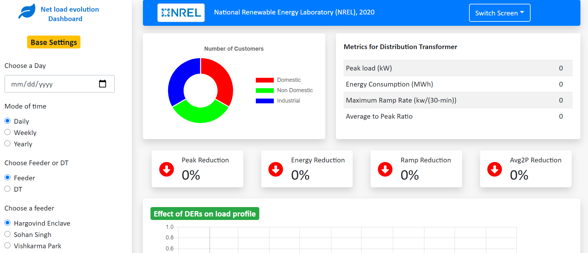

## EVOLVE 

EVOLVE stands for evolution of net-load variation from emerging technologies. This tool allows user to visuallize impact of emerging
technologies such as electric vehicle, energy storage and solar on net load evolution. Includes following features.

1. Metrics: Peak reuction, Energy consumption reduction, Ramp Rate, Average to Peak Ratio,
2. Technology specific results: generation and/or consumption profile, peak generation and/or consumption, generation and/or consumption at peak
3. Aggregated result: net load profile compared with base profile, load duration curve
4. Ability to change time scale: Daily, Weekly, Yearly
5. Ability to choose feeder, distribution transformers
6. Built in energy storage control algorithm (both time based and power based)
7. Optimization based battery sizing algorithm
8. Sweeping algorithm to determine best charging/discharging thresholds
9. Generate profile of electric vehicle based on number of vehicles and adoption percentage
10. Statistical profile dissaggration model 



### How to install ?

There are two ways you can use this tool. 

First (recommeded) way is to use docker to launch the containers (front end as well as backend). It saves time and you can use single command to launch both containers.
First clone or download the code and cd into that directory and run the following command.

```shell
    docker-compose up
```
Note: There are two things you need to do before you run above command. It may take sometime to build images for first time but from second time it will be fast.

1. Change the path of volumes in `docker-compose.yml` file
2. Make sure you have docker installed in your computer. (https://www.docker.com/)


Second way is to launch both services independently.

1. Clone the code (you can use command `git clone https://github.nrel.gov/kduwadi/BYPL-NREL-Effort.git`)
2. Create a virtual environment with preferably python 3.8 version
3. Install dependencies using command `pip install -r requirements.txt`
4. Install Node.js (https://nodejs.org/en/) 
5. Open up a command prompt from inside `react-app` folder and run command `npm install` 


#### Spin off the Python Server

It makes the RESTful API available to front end React App. 
Execute the command `python src\server\server.py`. 

#### Spin off the react front-end

From the react app directory, open up a command prompt and execute `npm start`


### Usage: If you want to use python modules independently


## Statistical model for profile and export prediction

```python
    model_instance = LinearModel(config_json_path="BYPL-NREL-Effort\\generate_profile\\config.json")
    model_instance.create_dataframe()
    model_instance.execute_all_lm()
    model_instance.export_all()
```

## Storage controller module

```python
    from battery_use_case.battery import EnergyStorage

    df = pd.read_csv(r'toydata.csv',parse_dates=True)
    df = df.set_index('TimeStamps')
    with open('BYPL-NREL-Effort//battery_use_case//battery.json','r') as json_file:
        battery_dict = json.load(json_file)

    with open('BYPL-NREL-Effort//battery_use_case//strategy.json','r') as json_file:
        strategy_dict = json.load(json_file)
    
    a = EnergyStorage(df,battery_dict,strategy_dict,0.5)
    resultdf = a.get_result()
```

