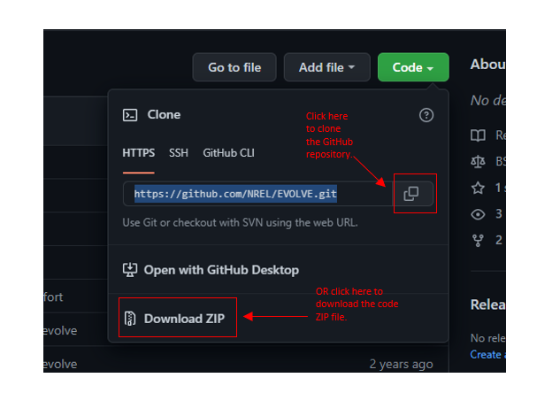
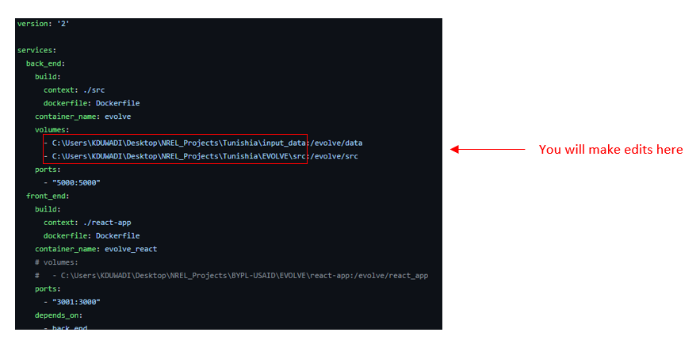

#### 2. Download EVOLVE code file folder onto your computer 

There are two options to download EVOLVE.

###### :star2: Using GitHub clone
Visit GitHub at https://github.com/nrel/evolve and “clone” the GitHub repository (see image). In order to clone you can use the command `git clone https://github.com/NREL/EVOLVE.git`

   

###### :sparkles: Direct Download [recommended for beginners]
Download the zipped program code directly from the GitHub repository (see image). Unzip this folder and save to your preferred file location (e.g., Desktop).  

#### 3. Set up EVOLVE file directories

Once you have downloaded and unzipped the EVOLVE code file folder (it should be called “EVOLVE-master or something similar), open the docker-compose.yml file. You will need to edit two lines of code to set up the EVOLVE file directories appropriately and run the EVOLVE tool on your machine. Please see the two example images provided below – the first illustrates directory set up with a Windows OS and the second with a Mac OS. There are some differeces, but the mechanics are generally the same. The next steps will walk you through the edits you need to make. 

#### 4. Launch EVOLVE dashboard

Now that you have set up your EVOLVE file directories and adapted them to your computer, it’s time to launch EVOLVE. There are a few steps you must follow: 

###### :snowflake: Open up a terminal

Search for "Command Prompt" if you are windows user. Mac users should press spacebar and search for "Terminal".

###### :snowflake: Navigate to EVOLVE folder directory

Click into the Command Prompt or Terminal interface to begin typing. You will type the command `cd` followed by a space and the directory where you saved the EVOLVE files. It should look something like this: `C:\Users\cooluser>cd \Desktop\EVOLVE-master` for Windows users or `~cooluser$ cd /Users/hlucas/Desktop/EVOLVE-master` for Mac users. The file directory should match the naming convention you used to edit the code in step 3. Once you have entered the file directory into the Command Prompt or Terminal interface, `hit enter`. 

###### :snowflake: Run Docker
After you hit enter on the above code, type `docker-compose up` into your Command Prompt or Terminal interface. `Hit enter`. This will launch the EVOLVE web interface from the code you downloaded earlier. Note that this might take a few minutes to load. 

###### :snowflake: Go to your internet browser and navigate to localhost:3001/dashboard 
This will pull up the EVOLVE dashboard. Now you are ready to go!  