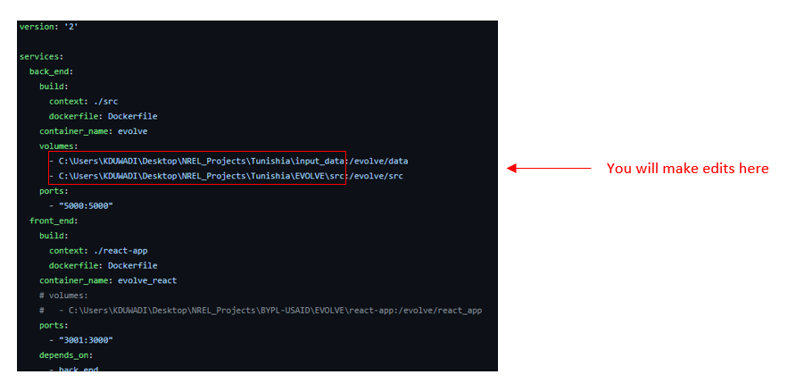

### :rocket: Installing and Using EVOLVE via Docker

#### :dolphin: What is Docker ?

Docker is an open platform for developing, shipping, and running applications. Docker enables you to separate your applications from your infrastructure so you can deliver software quickly. We are using Docker to containerize our front end and back end application separately and using `docker-compose.yml` file to launch both of them at the same time. [Learn more about docker here.](https://docs.docker.com/get-started/overview/)

There are four basic steps to download and begin using the EVOLVE tool:
1. Download the Docker software tool onto your computer.
2. Download EVOLVE code file folder onto your computer.
3. Set up EVOLVE file directories.
4. Launch EVOLVE dashboard.

#### 1. Download the Docker software tool onto your computer

Visit https://www.docker.com/get-started/ to download the Docker software. Choose your operating system (OS) type, download, and follow installation prompts.

_What to do if you receive an error when downloading Docker ?_

When using a Windows OS, if you are not part of the docker-users group, then you might get Docker Desktop – Access Denied error. To fix this error, run Computer Management as an administrator and navigate to `Local Users*` and `Groups > Groups > docker-users`. Right-click to add the user to the group. Log out and log back in for the changes to take effect. If you receive the same error warning when running a Linux OS, try the solution posted in this [Stackoverflow article](https://stackoverflow.com/questions/48957195/how-to-fix-docker-got-permission-denied-issue ). If you are installing docker desktop in Windows and your Windows version supports a subsystem for Linux (WSL 2) , [please refer to the steps outlined in this article.](https://docs.microsoft.com/en-us/windows/wsl/install)

#### 2. Download EVOLVE code file folder onto your computer

There are two options to download EVOLVE.

###### :star2: Using GitHub clone
Visit GitHub at https://github.com/nrel/evolve and “clone” the GitHub repository (see image). In order to clone you can use the command `git clone https://github.com/NREL/EVOLVE.git`

   

###### :sparkles: Direct Download [recommended for beginners]
Download the zipped program code directly from the GitHub repository (see image). Unzip this folder and save to your preferred file location (e.g., Desktop).  

#### 3. Set up EVOLVE file directories

Once you have downloaded and unzipped the EVOLVE code file folder (it should be called “EVOLVE-master or something similar), open the docker-compose.yml file. You will need to edit two lines of code to set up the EVOLVE file directories appropriately and run the EVOLVE tool on your machine. Please see the two example images provided below – the first illustrates directory set up with a Windows OS and the second with a Mac OS. There are some differeces, but the mechanics are generally the same. The next steps will walk you through the edits you need to make. 

#### 4. Launch EVOLVE dashboard

Now that you have set up your EVOLVE file directories and adapted them to your computer, it’s time to launch EVOLVE. There are a few steps you must follow: 

###### :snowflake: Open up a terminal

Search for "Command Prompt" if you are windows user. Mac users should press spacebar and search for "Terminal".

###### :snowflake: Navigate to EVOLVE folder directory

Click into the Command Prompt or Terminal interface to begin typing. You will type the command `cd` followed by a space and the directory where you saved the EVOLVE files. It should look something like this: `C:\Users\cooluser>cd \Desktop\EVOLVE-master` for Windows users or `~cooluser$ cd /Users/hlucas/Desktop/EVOLVE-master` for Mac users. The file directory should match the naming convention you used to edit the code in step 3. Once you have entered the file directory into the Command Prompt or Terminal interface, `hit enter`. 

###### :snowflake: Run Docker
After you hit enter on the above code, type `docker-compose up` into your Command Prompt or Terminal interface. `Hit enter`. This will launch the EVOLVE web interface from the code you downloaded earlier. Note that this might take a few minutes to load. 

###### :snowflake: Go to your internet browser and navigate to localhost:3001/dashboard 
This will pull up the EVOLVE dashboard. Now you are ready to go!  