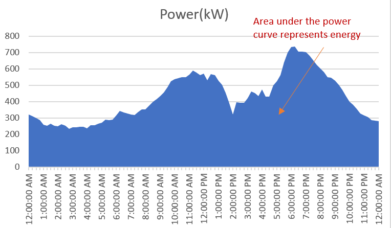
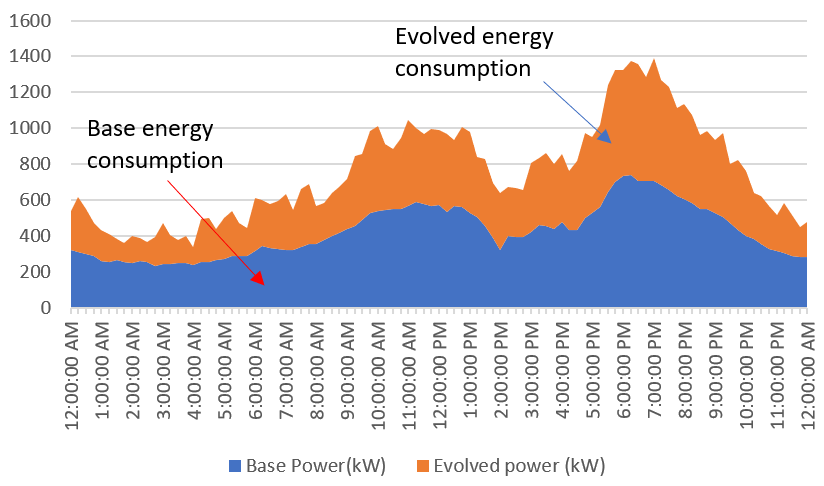

# Explanation for Metrics

!!! note

    Images used are just a toy data set and do not represent any real system data and is used only for
    demonstration purpose.

### Peak load

Peak load is defined as maximum load for specified time duration. Mathematically it is represented as below. 

$$
\operatorname{max}\{p_1, p_2, ...., p_t, ...., p_T\}
$$

### Energy consumption

Energy consumption is sum of power consumption at all time steps multiplied by time resolution. Note energy consumption shown in evolve dashboard is actually net energy consumption so negative value means energy is injected back to the grid. Default unit for energy consumption is MWh. Mathematically energy consumption is rereseneted as below. Here 
$p_t$ is power consumtion at time $t$ and $\delta T$ is time resolution in hour.

$$
\sum_{t=0}^{T} p_t \times \delta T
$$

### Maximum Ramp Rate

Maximum ramp rate in evolve dashboard represents absolute maximum change in power per hour. It's unit is MW/hr. Mathematically it is represented as below.

$$
\operatorname{max} \{\frac{|p_{t}- p_{t-1}|}{\delta T}  \forall t \}
$$

### Average to Peak Ratio

It is mathematically represented as below.

$$
\frac{\frac{1}{T}\sum_{t=0}^{T} p_t}{max\{p_1, p_2, ..., p_t, ..., p_T\}}
$$

### Peak Reduction

Peak reduction is percentage reduction in peak power in evolved (or new) load profile compared to base or reference profile.

### Energy Reduction

Energy reduction is percentage reduction in net energy consumption in evolved (or new) load profile compared to base or reference profile.

### Ramp Reduction

Ramp reduction is percentage reduction in maximum ramp rate of evolved (or new) load profile compared to base or reference profile.

### Avg2P Reduction

Avg2P reduction is percentage reduction in average to peak power of evolved (or new) load profile compared to base or reference profile.

## Solar metrics

---

### Energy Generation

Solar energy generation is just a sum of solar power at all time steps in a given duration multiplied by resolution. Unit of solar energy generation expressed in EVOLVE is kWh. 

### Generation at Peak

This metric represents solar power generation in kW at the time of evolved load profile peak time for a specified duration.

### Peak Generation

This metric represents peak solar power in kW for a user specified duration.

## Energy storage metrics

---

### Charging energy

This metrics represents total energy spent charging energy storage for a user specified duration in kWhr.

### Discharging energy

This metrics represents total energy discharged from energy storage for a user specified duration in kWhr.

### C/D Cycles

This metric represents number of charging/discharging cycles for energy storage.

