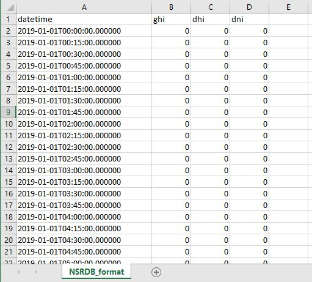
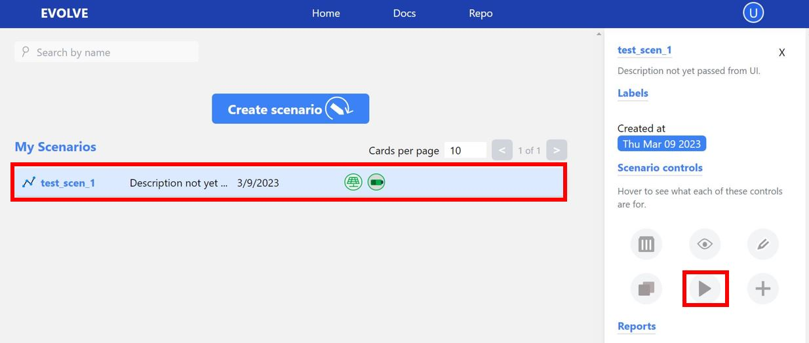

# User Interface 

This page walks you through different parts of the user interface and how to use them.

## Signing up

Once you are on evolve landing page you can navigate to `http://localhost:5001/login` (make sure to change this address if evolve is deployed in remote server and/or if you have changed the port.) to create new user account. Select the <mark style="background-color: #FFFFFF"><u>Sign up as new user</u></mark> link. Fill out a username, password, and email address. Once your account is created, you will be directed to the login page. If you run into issues signing up. Please right click and inspect.

!!! note

    In your console, if you see `CORS` related error, then probably it's because something else is running at port (by default 8000) where API is running. If you do have something running at default port then you can either stop the service running at that port or you can change the port where backend api is running either through docker or using cli if you are running locally. Note if you change the API port then you will need to update `REACT_APP_EVOLVE_BACKEND_URL`. 

!!! note

    In your console, if you see other issues feel free to create an issue at https://github.com/NREL/EVOLVE/issues with exact error message from console.

## Home Page
The homepage has several main features, explained in detail below.

1. Toolbar
2. Manage Your Data
3. Create Scenarios
4. Manage Scenarios
5. Manage Labels

### Toolbar
The first feature to note, is the blue toolbar at the top of your browser window:

- The **`Home`** button will return the user to the Home Page at any time. 
- The **`Docs`** button will direct the user to the following page with user instructions for installing docker, navigating the EVOLVE UI, downloading and editing the source code, using the legacy dashboard, and explanations of EVOLVE metrics. One can navigate these catgegories using the toolbar on the left of your window or the Next button in the bottom right. 
- The **`Repo`** will direct the user to the EVOLVE github repository, where contributors can clone the repository, make pull requests, or raise issues. 

### Manage Your Data
The `Manage Your Data` tab is where the user will upload and manage timeseries data for load and/or irradiance values. The page will initially be blank until the user has uploaded datasets. To do so, first click on the blue **`Upload Data`**  button. 

The user must first have a csv file prepared with the desired data to upload. The csv file should have two columns: a timestamp and the kw or irradiance values. The example below shows both types of data in the correct format for use in EVOLVE. The user must fill out the required fields, select the desired csv file, and click the blue **`Submit`** button.

This figure shows screenshot of load csv file.

This figure shows screenshot of irradiance csv file.

This figure shows snapshot of upload data section in UI.

Done correctly, and one should see their two datasets displayed as shown below. 

### Create Scenarios

After uploading data, the user must create scenarios they wish to model. This can be done by clicking the  `Create Scenarios` tab in home page. 
The user should pick a name for their scenario and select the desired technologies they wish to model.
The Basic Settings window is for adding information regarding the circuit's load profile. Select the load profile, a start and end date, and a data resolution. Note: if the user selects a data resolution that is smaller than that of the selected load profile, one will need to also select the data filling strategy. 

For the selected technologies, fill out the required fields. One can add additional solar, EV, or energy storage systems (up to 5) using the blue button above each technology window. 

Once complete, click the blue **`Submit`** button at the bottom of the page. 

### Manage Scenarios
The next step is to run your scenario and produce results. This can be done on the Manage Scenarios tab. 

To run a scenario, click on the scenario and then select the grey play button on the right tool bar. One will be prompted to name the report and add a description. Once can also use this toolbar to delete, view, edit, or clone a given scenario as well as view any reports.

Once completed, the user should see an orange Completed under the report name. To view the results, click on the eye symbol on the report. 

One can visualize report results on this page or use the orange **`Download Results!`** button to download csv files containing all data. 

### Manage Labels
Lastly, users can use the Manage Labels tab to create labels to help organize and search for scenarios. Use the create label button, add a name and description, and then one can add this label to scenarios using the grey plus icon on the report toolbar. These labels can be used to filter a large number of scenarios.

The user can filter their scenarios with the label buttons at the top of the Manage Scenarios Page.

